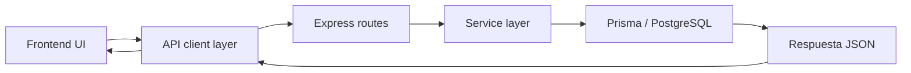

# Optimización de llamadas al servidor y base de datos

## 1) Objetivo

Reducir carga en el backend, evitar consultas redundantes, mejorar tiempos de respuesta y evitar que el sistema colapse cuando crece el número de clientes, facturas, pagos o productos.

Este documento está basado en el stack real del proyecto:
- Backend: Node.js + Express + Prisma + PostgreSQL
- Frontend: React + Vite
- Arquitectura actual: [backend/src/app.js](backend/src/app.js), [frontend/src/services/api.js](frontend/src/services/api.js), [backend/prisma/schema.prisma](backend/prisma/schema.prisma)

---

## 2) Estructura recomendada del flujo



### Capas recomendadas

1. Frontend
   - centraliza peticiones en un servicio único
   - evita lógica de negocio en componentes
   - usa paginación y filtros

2. Backend
   - routes: solo reciben y responden
   - services: lógica de negocio y consultas
   - prisma: solo acceso de datos

3. Base de datos
   - consultas optimizadas
   - índices correctos
   - reglas de paginación
   - transacciones para cambios críticos

---

## 3) Patrón de consumo recomendado en el frontend

### 3.1 API client centralizado

La capa actual en [frontend/src/services/api.js](frontend/src/services/api.js) ya es buena porque centraliza llamadas, agrega timeout y maneja errores. Eso se mantiene.

Ejemplo base:

```js
const API_URL = import.meta.env.VITE_API_URL || '/api';

export async function request(endpoint, options = {}) {
  const token = localStorage.getItem('token');

  const controller = new AbortController();
  const timeout = setTimeout(() => controller.abort(), 15000);

  try {
    const res = await fetch(`${API_URL}${endpoint}`, {
      ...options,
      headers: {
        'Content-Type': 'application/json',
        ...(token ? { Authorization: `Bearer ${token}` } : {}),
        ...(options.headers || {})
      },
      signal: controller.signal
    });

    if (!res.ok) {
      const err = await res.json().catch(() => ({}));
      throw new Error(err.message || 'Error del servidor');
    }

    return res.status === 204 ? null : res.json();
  } finally {
    clearTimeout(timeout);
  }
}
```

### 3.2 Recomendación

- No hacer llamadas masivas en cada render.
- No consultar listas completas si solo se muestran 20 o 50 registros.
- Paginación obligatoria en listados grandes.
- Búsquedas con `debounce` para evitar saturar el servidor.

Ejemplo:

```js
API.getFacturas({ page: 1, limit: 20, estado: 'PENDING' });
API.getClientes({ page: 1, limit: 50, q: 'andres' });
API.getProductos({ page: 1, limit: 100, categoria: 'frutas' });
```

---

## 4) Patrón recomendado en backend

### 4.1 Separar rutas, servicios y consultas

En Express, idealmente:

```js
router.get('/facturas', authMiddleware, async (req, res, next) => {
  try {
    const page = Number(req.query.page || 1);
    const limit = Math.min(Number(req.query.limit || 20), 100);

    const result = await facturaService.list({
      empresaId: req.user.empresaId,
      page,
      limit,
      estado: req.query.estado
    });

    res.json(result);
  } catch (err) {
    next(err);
  }
});
```

Servicio:

```js
async function list({ empresaId, page, limit, estado }) {
  const skip = (page - 1) * limit;

  const [items, total] = await prisma.$transaction([
    prisma.factura.findMany({
      where: {
        empresaId,
        ...(estado ? { estado } : {})
      },
      select: {
        id: true,
        numeroFactura: true,
        total: true,
        estado: true,
        fechaEmision: true,
        cliente: { select: { razonSocial: true } }
      },
      orderBy: { fechaEmision: 'desc' },
      skip,
      take: limit
    }),
    prisma.factura.count({
      where: {
        empresaId,
        ...(estado ? { estado } : {})
      }
    })
  ]);

  return {
    items,
    page,
    limit,
    totalPages: Math.ceil(total / limit),
    total
  };
}
```

Esto evita que cada request cargue todo el dataset.

---

## 5) Qué está causando presión en este proyecto

### 5.1 Dashboard pesado

El dashboard en [backend/src/app.js](backend/src/app.js) hace varias consultas en un mismo request, incluyendo:
- pagos del mes
- facturas vencidas
- productos
- facturas recientes
- totales por estado
- ingresos históricos por 6 meses

Eso puede escalar rápidamente si hay muchas operaciones. Hay varias consultas dentro del mismo endpoint, y cada una va a la BD con filtros que pueden ser costosos.

### 5.2 N+1 pattern posible

En modelos relacionales como:
- `Factura` con `cliente`
- `Factura` con `items`
- `Pago` con `factura`
- `Dashboard` con muchos cálculos

la tendencia es consultar repetidamente datos relacionados en bucles o en varios `findMany` por cada dato.

### 5.3 Ausencia de paginación

Muchos listados del sistema probablemente cargan recursos completos. Eso puede generar:
- respuesta grande
- memoria alta en frontend
- tiempo alto de render
- saturación de la BD

---

## 6) Recomendaciones concretas de optimización

### 6.1 Paginación y filtros

Todas las rutas de listado deben soportar:
- `page`
- `limit`
- `q` para búsqueda
- `estado`, `fecha`, `empresaId`, etc.

Ejemplo:

```http
GET /api/facturas?page=1&limit=20&estado=PENDING
GET /api/clientes?page=1&limit=50&q=juan
GET /api/productos?page=1&limit=100&activo=true
```

### 6.2 Búsquedas con debounce

En frontend, cuando se escribe el texto de búsqueda, no disparar todos los fetch a cada letra; se recomienda:

```js
const value = inputValue;
clearTimeout(timer);
timer = setTimeout(() => fetchData(value), 350);
```

### 6.3 Caché de resultados listados

Para datos que no cambian cada segundo:
- usuarios
- clientes
- productos
- facturas recientes

usar cache de 15 a 60 segundos en frontend o backend para evitar repetir consultas.

### 6.4 Transacciones críticas

Usar `prisma.$transaction` para:
- crear factura + items + pagos
- cerrar caja
- actualizar stock e inventario
- cambios multi-tabla relacionados

### 6.5 Indexación DB

Revisar en [backend/prisma/schema.prisma](backend/prisma/schema.prisma) si faltan índices para:

- `facturas.empresaId`
- `facturas.estado`
- `facturas.fechaEmision`
- `clientes.empresaId`
- `productos.empresaId`
- `pagos.facturaId`
- `pagos.fechaPago`
- `usuarios.empresaId`
- `usuarios.username`

---

## 7) Estructura recomendada del proyecto para escalar

```txt
backend/
  src/
    routes/
      clientes.js
      productos.js
      facturas.js
      dashboard.js
    services/
      clientesService.js
      productosService.js
      facturasService.js
      dashboardService.js
    utils/
      pagination.js
      errors.js
      cache.js
frontend/
  src/
    services/
      api.js
      clientesApi.js
      productosApi.js
      facturasApi.js
    hooks/
      useClientes.js
      useProductos.js
      useFacturas.js
    pages/
      ...
```

### Beneficio
- limpieza de responsabilidades
- más fácil probar
- más fácil medir cuellos de botella
- evita que rutas crezcan sin control

---

## 8) Regla práctica para evitar colapso

### Regla 1: ninguna lista grande sin paginación
### Regla 2: ningún dashboard con más de 3 consultas pesadas sin refactorizar
### Regla 3: ninguna operación crítica sin transacción
### Regla 4: búsquedas de texto con debounce
### Regla 5: cache para listas repetidas
### Regla 6: monitorear tiempos de respuesta por endpoint

---

## 9) Recomendación final para este proyecto

La mejora más efectiva y menos riesgosa para tu caso es:

1. Agregar paginación a todos los listados.
2. Reestructurar el dashboard para reducir consultas pesadas.
3. Centralizar consultas en services.
4. Asegurar índices correctos en Prisma.
5. Usar transacciones para operaciones multi-tabla.
6. Medir tiempos por endpoint antes de hacer cualquier cambio grande.

Esto te permite mejorar rendimiento sin romper funcionalidad existente.

---

## 10) Siguiente paso recomendado

Si quieres, en la siguiente iteración te preparo:
- una propuesta exacta de servicios para backend
- una estructura de hooks para React
- un plan de optimización detallado para dashboard, productos, clientes y facturas.
